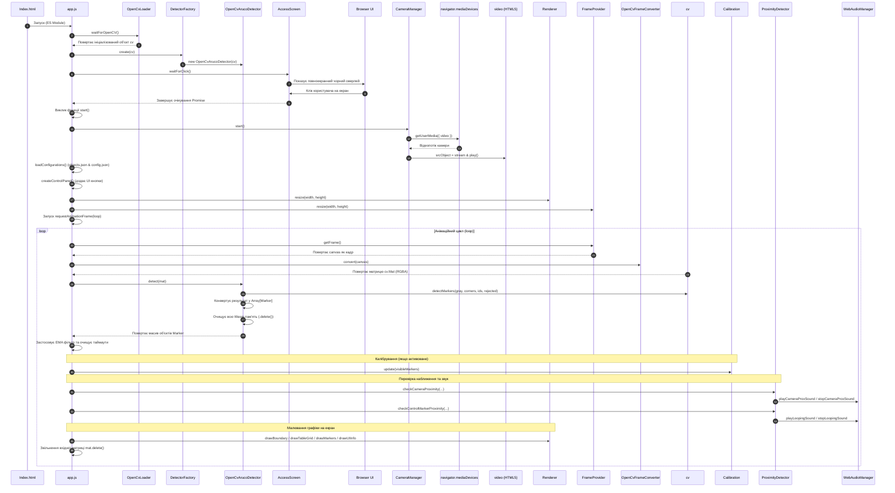

# Документація проекту `Web-Audio-AR-Chess` (Веб-клієнт для візуалізації ArUco)

Проект `Web-Audio-AR-Chess` є клієнтським веб-застосунком для виявлення та візуалізації ArUco-маркерів у реальному часі безпосередньо у браузері. Програма використовує веб-камеру користувача як джерело відеопотоку, обробляє кадри за допомогою комп'ютерного зору бібліотеки OpenCV.js (WebAssembly), детектує маркери зі словника `DICT_4X4_1000` та малює їхні межі та ідентифікатори поверх відео на HTML5-екрані (Canvas).

---

## 1. Структури даних (Data Structures)

У проекті виявлено два типи структур даних: активні (які використовуються в основній логіці) та неактивні (невикористовуваний "мертвий" код моделей).

### 1.1. Активні структури даних

#### 1.1.1. Об'єкт конфігурації `Config` (модуль `js/config/config.js`)
Визначає параметри роботи камери, візуалізації, детектора та логіки наближення:
* `cameraWidth`, `cameraHeight` (number): Розміри кадру.
* `fps` (number): Частота кадрів.
* `markerColor`, `textColor` (string): Стилі малювання.
* `lineWidth` (number): Товщина ліній.
* `dictionary` (string): Назва словника (`"DICT_4X4_1000"`).
* `boundaryIds` (array of number): Ідентифікатори кутових маркерів меж (`[155, 206, 221, 176]`).
* `controlMarkerId` (number): ID керуючого маркера (`85`).
* `gridProximityThreshold` (number): Поріг наближення на дошці (у клітинках сітки, за замовчуванням `0.6`).
* `cameraProxHeightThreshold` (number): Поріг наближення до камери (відносна висота підняття `0.0..1.0`, за замовчуванням `0.4`).
* `markerTimeoutMs` (number): Час зникнення маркера у мс.
* `emaAlpha` (number): Коефіцієнт згладжування фільтра EMA.

#### 1.1.2. Клас `Marker` (модуль `js/models/Marker.js`)
Активний клас-модель, що описує стан виявленого ArUco-маркера:
* `id` (number): Ідентифікатор маркера.
* `corners` (array of `Point`): Екранні координати 4-х кутів.
* `timestamp` (number): Час останнього оновлення.
* `center` (Point, getter): Розрахований 2D-центр маркера в пікселях.
* `getPixelWidth()` (number): Повертає середню ширину маркера в пікселях для розрахунку відносної висоти підняття.

#### 1.1.3. Стан калібрування `Calibration` (модуль `js/core/Calibration.js`)
Зберігає калібрувальні дані для проектування на сітку столу:
* `tableZone` (array of `Point`): 2D-координати 4-х кутів столу (TL, TR, BR, BL).
* `board_to_image_matrix`, `image_to_board_matrix` (cv.Mat): Матриці 2D-гомографії (3x3).
* `pCalib` (number): Еталонний піксельний розмір маркерів на столі для розрахунку висоти підняття.

#### 1.1.4. Стан блокування об'єкта `lockedObjectState` (модуль `js/detector/ProximityDetector.js`)
Використовується для утримання фокусу на об'єкті біля маркера керування (ефект гістерезису):
* `markerId` (number): ID заблокованого об'єкта.
* `savedPos` (Point): Збережена 2D-координата об'єкта на сітці столу на момент захоплення.
* `audioName` (string): Назва звукового файлу для відтворення.
* `recentDistances` (array of number): Останні 5 значень відстаней для згладжування (ковзне середнє).

---

### 1.2. Неактивні структури даних (Мертвий код моделей)
Ці класи описані у файлах проекту, проте не використовуються в поточній логіці:
* `Frame` (модуль `js/models/Frame.js`)
* `MarkerCollection` (модуль `js/models/MarkerCollection.js`)
* `MarkerDetection` (модуль `js/models/MarkerDetection.js`)

### 1.3. Структура конфігураційного файлу `objects.json`
Файл `objects.json` визначає директорію зі звуковими ефектами та зіставляє ідентифікатори маркерів ArUco із шаховими фігурами та об'єктами керування:
* `audio_directory` (string): Відносний шлях до папки з аудіофайлами (наприклад, `"audio/"`).
* `objects` (array of object): Список об'єктів/фігур, де кожен елемент містить:
  * `obj_id` (number): Унікальний числовий ідентифікатор об'єкта.
  * `marker_id` (number): Відповідний ідентифікатор ArUco-маркера.
  * `name` (string): Назва об'єкта чи фігури (наприклад, `"біла тура"`, `"білий пішак"`).
  * `obj_type` (string, neoбов'язково): Тип об'єкта (наприклад, `"control"` для позначення керуючого маркера).

### 1.4. Структура конфігураційного файлу `config.json`
Файл `config.json` містить налаштування безпечної зони для виявлення маркерів:
* `safety_zone_margin_pct` (number): Відсоток відступу безпечної зони від кожного краю відеокадру (наприклад, `10` для 10%).

---

## 2. Дерево функцій програмних модулів (Function Tree)

Нижче наведено ієрархію функцій та методів проекту, згруповану по логічних модулях:

```
js
│
├── app.js
│   ├── start()
│   ├── loop()
│   ├── loadConfigurations()
│   ├── getScaledOptimalZone()
│   └── createControlPanel()
│
├── audio
│   └── WebAudioManager.js
│       └── class WebAudioManager
│           ├── constructor(audioBaseDir)
│           ├── init()
│           ├── playBeep(frequency, durationMs)
│           ├── playCalibrationBeeps()
│           ├── playLoopingSound(filename)
│           ├── stopLoopingSound()
│           ├── playCameraProxSound(markerId, filename)
│           ├── stopCameraProxSound(markerId)
│           └── stopAllSounds()
│
├── camera
│   └── CameraManager.js
│       └── class CameraManager
│           ├── constructor(video)
│           └── start()
│
├── config
│   └── config.js  [Об'єкт Config]
│
├── core
│   ├── FrameProvider.js
│   │   └── class FrameProvider
│   │       ├── constructor(video)
│   │       ├── resize(width, height)
│   │       └── getFrame()
│   │
│   ├── Calibration.js
│   │   └── class Calibration
│   │       ├── constructor(cv, durationMs)
│   │       ├── start()
│   │       ├── isCalibratingNow()
│   │       ├── update(visibleMarkers, boundaryIds)
│   │       ├── finish(boundaryIds)
│   │       ├── projectToGrid(pt)
│   │       └── projectToImage(gridPt)
│   │
│   └── cvLoader.js  [НЕАКТИВНИЙ / МЕРТВИЙ КОД]
│
├── detector
│   ├── ArucoDetector.js
│   ├── DetectorFactory.js
│   ├── OpenCvArucoDetector.js
│   │   └── class OpenCvArucoDetector
│   │       ├── constructor(cv)
│   │       └── detect(frame)
│   │
│   └── ProximityDetector.js
│       └── class ProximityDetector
│           ├── constructor(audioManager, gracePeriodMs)
│           ├── checkCameraProximity(markers, objectsData, calibration, heightThreshold)
│           └── checkControlMarkerProximity(controlMarker, markers, objectsData, calibration, proximityThreshold)
│
├── models
│   ├── Marker.js
│   │   └── class Marker
│   │       ├── constructor(id)
│   │       ├── addCorner(x, y)
│   │       ├── get center()
│   │       └── getPixelWidth()
│   │
│   └── Point.js
│
├── opencv
│   ├── OpenCvFrameConverter.js
│   └── OpenCvLoader.js
│
├── renderer
│   └── Renderer.js
│       └── class Renderer
│           ├── constructor(canvas)
│           ├── resize(width, height)
│           ├── clear()
│           ├── drawMarkers(markers)
│           ├── drawBoundary(calibration)
│           ├── drawTableGrid(calibration)
│           ├── drawProjectedMarkers(markers, calibration)
│           ├── drawUIInfo(...)
│           └── drawOptimalZone(optimalZone)
│
└── ui
    └── AccessScreen.js
```

### Схема роботи та взаємодії модулів веб-клієнта:




---

## 3. Алгоритми роботи функцій (Function Algorithms)

Детальний опис алгоритмів та послідовності кроків роботи для кожної функції:

### 3.1. Модуль `js/app.js` (Точка входу)

#### Глобальний сценарій ініціалізації
1. Виводить у консоль повідомлення про старт застосунку.
2. Знаходить у DOM-документі HTML-елементи `video` та `canvas`.
3. Асинхронно очікує ініціалізації OpenCV за допомогою `OpenCvLoader.waitForOpenCV()`.
4. Створює детектор маркерів через `DetectorFactory.create(cv)`.
5. Створює екземпляри класів `CameraManager`, `Renderer`, `FrameProvider`, `OpenCvFrameConverter` та `AccessScreen`.
6. Асинхронно очікує кліку користувача по екрану через `accessScreen.waitForClick()` (необхідно для авторизації запуску камери та аудіо у сучасних браузерах).
7. Викликає асинхронну функцію `start()`.

#### `start()` [Асинхронний метод]
1. Логує повідомлення "Starting camera".
2. Викликає та очікує виконання `camera.start()` для отримання відеопотоку.
3. Зчитує реальну роздільну здатність відео (`video.videoWidth`, `video.videoHeight`).
4. Налаштовує розміри полотна відображення через `renderer.resize(...)` та внутрішнє полотно знімання кадрів `frameProvider.resize(...)`.
5. Перевіряє статус готовності відео: якщо `video.readyState` дорівнює `HTMLMediaElement.HAVE_ENOUGH_DATA`:
   - Робить тестове знімання кадру `frameProvider.getFrame()`.
   - Конвертує отриманий кадр у матрицю `frameConverter.convert(frame)`.
   - Запускає тестове детектування `detector.detect(mat)`.
   - Звільняє WebAssembly-пам'ять викликом `.delete()` для об'єктів `markers.corners`, `markers.rejected` (якщо є), `markers.ids` та базової матриці `mat`.
6. Якщо відео не готове, виводить попередження "Video frame is not ready".
7. Реєструє функцію `loop` для виконання при наступному оновленні екрану через `requestAnimationFrame(loop)`.

#### `loop()`
1. Перевіряє, чи відео має достатньо даних для зчитування (`HAVE_ENOUGH_DATA`).
2. Якщо дані є:
   - Зчитує поточний кадр-полотно через `frameProvider.getFrame()`.
   - Конвертує його на матрицю зображення `mat` через `frameConverter.convert(frameCanvas)`.
   - Запускає розпізнавання маркерів `detector.detect(mat)`.
   - Оновлює лічильник знайдених маркерів `markers.count` значенням кількості рядків матриці `markers.ids.rows` (якщо ідентифікатори виявлені), інакше записує `0`.
   - Копіює поточний кадр з камери на Canvas відображення: `renderer.ctx.drawImage(frameCanvas, 0, 0)`.
   - Малює рамки маркерів та ідентифікатори на екрані через `renderer.drawMarkers(markers)`.
   - Виконує очищення пам'яті (крок за кроком викликає `.delete()` для `markers.corners`, `markers.ids` та матриці `mat`).
3. Викликає `requestAnimationFrame(loop)` для планування наступного кадру циклу.

---

### 3.2. Модуль `js/camera/CameraManager.js`

#### `constructor(video)`
1. Зберігає посилання на HTML5 відеоелемент `video` у полі `this.video`.

#### `start()` [Асинхронний метод]
1. Викликає `navigator.mediaDevices.getUserMedia`, запитуючи доступ до камери:
   - Роздільна здатність задається параметрами `Config.cameraWidth` та `Config.cameraHeight`.
   - Вказується параметр `facingMode: "environment"` для надання пріоритету задній камері на мобільних пристроях.
2. Отримує об'єкт медіапотоку `stream` та призначає його властивості `srcObject` відеоелемента.
3. Викликає асинхронний метод `this.video.play()` для запуску відтворення відео.
4. Логує повідомлення "Camera started" за допомогою `Logger.info`.

---

### 3.3. Модуль `js/core/cvLoader.js` [НЕАКТИВНИЙ]

#### `load()` [Статичний асинхронний метод]
1. Повертає новий об'єкт `Promise`.
2. Перевіряє, чи визначена глобальна змінна `cv` у системі. Якщо ні — повертає відхилення (`reject`) з повідомленням про помилку.
3. Якщо у об'єкті `cv` є метод `cv.getBuildInformation`, це свідчить про готовність бібліотеки — Promise успішно виконується (`resolve`).
4. Якщо бібліотека завантажується, реєструє функцію зворотного виклику `cv.onRuntimeInitialized = () => { resolve(); }`, яка виконає `resolve` після повної готовності WebAssembly-модуля.

---

### 3.4. Модуль `js/core/FrameProvider.js`

#### `constructor(video)`
1. Зберігає відеоелемент у властивості `this.video`.
2. Створює прихований фоновий HTML5 елемент `canvas` за допомогою `document.createElement("canvas")`.
3. Отримує та зберігає 2D контекст малювання цього полотна `this.context`.

#### `resize(width, height)`
1. Задає внутрішню ширину фонового полотна `this.canvas.width = width`.
2. Задає внутрішню висоту фонового полотна `this.canvas.height = height`.

#### `getFrame()`
1. Малює поточний кадр із відеоелемента `this.video` на внутрішній канвас, починаючи з координат `(0, 0)` та розтягуючи на повний розмір полотна (`this.canvas.width`, `this.canvas.height`).
2. Повертає об'єкт фонового полотна `this.canvas` як результат знятого кадру.

---

### 3.5. Модуль `js/detector/ArucoDetector.js`

#### `detect(frame)`
1. Викидає помилку `"detect() must be implemented."` (метод є абстрактним інтерфейсним методом, що вимагає перевизначення у класах-наслідниках).

---

### 3.6. Модуль `js/detector/DetectorFactory.js`

#### `create(cv)` [Статичний метод]
1. Створює та повертає новий екземпляр класу `OpenCvArucoDetector`, передаючи йому об'єкт `cv`.

---

### 3.7. Модуль `js/detector/OpenCvArucoDetector.js`

#### `constructor(cv)`
1. Зберігає об'єкт OpenCV у полі `this.cv`.
2. Завантажує наперед заданий словник маркерів через `cv.getPredefinedDictionary(cv.DICT_4X4_1000)`.
3. Ініціалізує параметри детектора за замовчуванням `new cv.aruco_DetectorParameters()`.
4. Створює параметри покращення контурів `new cv.RefineParameters(10.0, 3.0, false)`. (Примітка: у коді використовується `cv.aruco_RefineParameters`).
5. Створює об'єкт детектора ArUco: `new cv.aruco_ArucoDetector(...)`.

#### `detect(frame)`
1. Створює порожню матрицю `gray` для збереження чорно-білого кадру.
2. Конвертує кольоровий кадр `frame` з колірного простору RGBA у відтінки сірого за допомогою `this.cv.cvtColor(frame, gray, this.cv.COLOR_RGBA2GRAY)`.
3. Створює об'єкти для запису вихідних результатів роботи алгоритму:
   - `corners` (новий `cv.MatVector`): вектор кутів.
   - `ids` (новий `cv.Mat`): матриця ідентифікаторів.
   - `rejected` (новий `cv.MatVector`): вектор відхилених контурів.
4. Викликає метод виявлення маркерів: `this.detector.detectMarkers(gray, corners, ids, rejected)`.
5. Звільняє пам'ять від тимчасового чорно-білого кадру: `gray.delete()`.
6. Повертає новий об'єкт `MarkerDetection(corners, ids)`.
> [!WARNING]
> **Витік пам'яті (Memory Leak):** У цьому методі створюється об'єкт `rejected = new this.cv.MatVector()`, який не передається в `MarkerDetection` і для якого не викликається метод `.delete()`. Оскільки він створюється на кожному кадрі циклу (30-60 разів на секунду), це викликає поступовий витік пам'яті в WebAssembly. Для виправлення необхідно додати `rejected.delete()` перед блоком `return`.

---

### 3.8. Модуль `js/opencv/OpenCvFrameConverter.js`

#### `constructor(cv)`
1. Зберігає посилання на `cv`.

#### `convert(canvas)`
1. Зчитує зображення з HTML5 Canvas елемента та перетворює його на об'єкт матриці `cv.Mat` за допомогою вбудованої функції OpenCV: `this.cv.imread(canvas)`.

---

### 3.9. Модуль `js/opencv/OpenCvLoader.js`

#### `waitForOpenCV()` [Статичний асинхронний метод]
1. Перевіряє наявність об'єкта `window.cv` у глобальній області видимості. Якщо він не знайдений, генерує помилку "OpenCV is not loaded."
2. Перевіряє, чи є `window.cv` об'єктом класу `Promise` (що свідчить про асинхронне завантаження):
   - Якщо це Promise, очікує його вирішення (`await window.cv`) для отримання об'єкта OpenCV.
   - Якщо це безпосередньо об'єкт, повертає його.
3. Виводить у консоль налагоджувальну інформацію про успішну ініціалізацію та наявність ключових класів (`cv.Mat`, `cv.aruco_ArucoDetector`).
4. Повертає готовий до роботи об'єкт `cv`.

---

### 3.10. Модуль `js/renderer/Renderer.js`

#### `constructor(canvas)`
1. Зберігає HTML5 Canvas елемент у полі `this.canvas`.
2. Отримує 2D контекст малювання полотна `this.ctx = canvas.getContext("2d")`.

#### `resize(width, height)`
1. Змінює ширину канвасу відображення: `this.canvas.width = width`.
2. Змінює висоту канвасу відображення: `this.canvas.height = height`.

#### `clear()`
1. Очищає всю область полотна від малюнків: `this.ctx.clearRect(...)`.

#### `drawMarkers(markers)`
1. Перевіряє, чи об'єкт маркерів існує та чи кількість знайдених об'єктів `markers.count` більша за `0`. Якщо ні, виходить з методу.
2. Встановлює стилі малювання контексту:
   - Колір ліній контуру: зелений (`"lime"`).
   - Товщина ліній: `2` пікселі.
   - Шрифт і розмір тексту: `"17px Arial"`.
   - Колір заливки тексту: жовтий (`"yellow"`).
3. Проходить у циклі по кожному виявленому маркеру (від `0` до `markers.count - 1`):
   - Отримує кути поточного маркера: `corner = markers.corners.get(i)`.
   - Починає шлях малювання контуру `ctx.beginPath()`.
   - Переходить у першу кутову точку: `ctx.moveTo(corner.data32F[0], corner.data32F[1])`.
   - Послідовно проводить лінії до 2-го, 3-го та 4-го кутів за допомогою циклу:
     - X-координата: `corner.data32F[j * 2]`
     - Y-координата: `corner.data32F[j * 2 + 1]`
   - Закриває контур (`ctx.closePath()`) та обводить його на екрані (`ctx.stroke()`).
   - Якщо матриця ідентифікаторів `markers.ids` існує та містить запис для цього маркера:
     - Зчитує ID маркера: `id = markers.ids.data[i]`.
     - Визначає координати першого кута як точку початку тексту: `x = corner.data32F[0]`, `y = corner.data32F[1]`.
     - Малює текст ідентифікатора зміщеним на 10 пікселів праворуч і вгору від першого кута: `ctx.fillText(id, x + 10, y - 10)`.

---

### 3.11. Модуль `js/ui/AccessScreen.js`

#### `constructor()`
1. Створює чорний повноекранний фоновий блок `div` (`this.overlay`).
2. Встановлює його CSS стилі програмно (фіксована позиція, 100% ширина та висота, чорний фон `#000`, центрований flexbox, високий z-index `1000` для показу поверх усього та вказівник курсору у вигляді руки).
3. Створює текстовий блок `div`, задає йому білий колір, шрифт Arial, розмір 26px, вирівнювання по центру та текст: `"Натисніть на екран<br>для запуску камери"`.
4. Додає текстовий блок до фонового оверлею.

#### `waitForClick()` [Асинхронний метод]
1. Додає створений оверлей на сторінку: `document.body.appendChild(this.overlay)`.
2. Повертає новий `Promise`, який вирішується (`resolve`), коли користувач натискає на екран:
   - Додає обробник події `"click"` на оверлей із параметром `{ once: true }` (щоб подія спрацювала лише один раз).
   - Після кліку видаляє оверлей зі сторінки (`this.overlay.remove()`) та викликає `resolve()`.

---

### 3.12. Модуль `js/utils/logger.js`

#### `info(message)` [Статичний метод]
1. Виводить інформаційне повідомлення `message` у консоль через `console.log`.

#### `error(message)` [Статичний метод]
1. Виводить повідомлення про помилку `message` у консоль через `console.error`.

---
